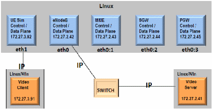
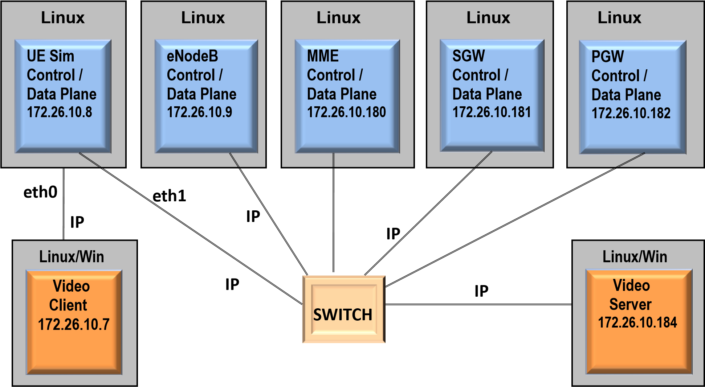
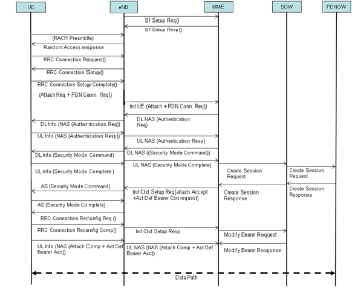
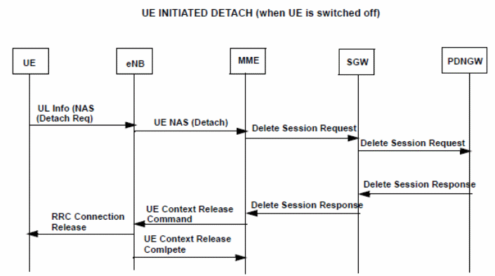
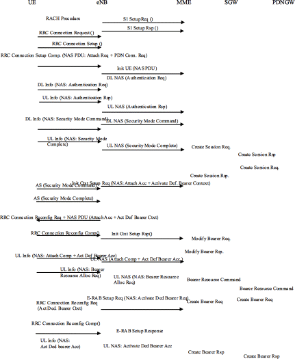
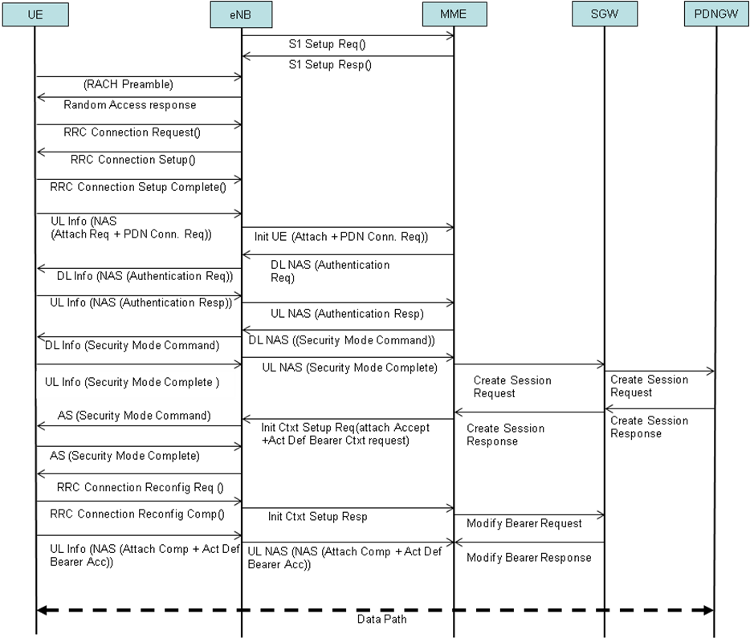
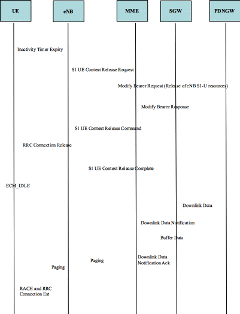
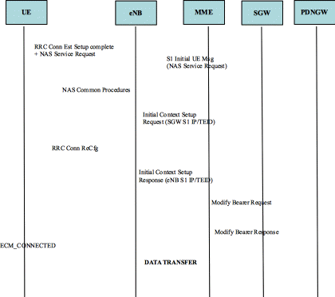
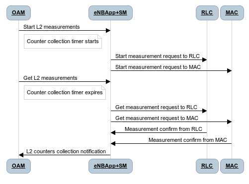

\
\

\
\

\
\

\
\

++
|  |
++
|  |
++
|  |
++
|  |
++

\
\

\
\

**Contents**

\

**[1.](#_Toc418590590){.western}**[**Preface
6**](#_Toc418590590){.western}

[1.1 Objective 6](#_Toc418590591){.western}

[1.2 Audience 6](#_Toc418590592){.western}

[1.3 Document Organization 6](#_Toc418590593){.western}

[1.4 Release History 7](#_Toc418590594){.western}

**[2.](#_Toc418590595){.western}**[**Introduction
8**](#_Toc418590595){.western}

[2.1 Product Description 8](#_Toc418590596){.western}

[2.2 Definitions and Acronyms 11](#_Toc418590597){.western}

**[3.](#_Toc418590598){.western}**[**Setup (End-to-End Solution)
17**](#_Toc418590598){.western}

[3.1 End-to-End Demo with Uu Stacks on Single Linux Machine
17](#_Toc418590599){.western}

[3.2 End-to-End Demo with Uu Stacks on Multiple Linux Machines
18](#_Toc418590600){.western}

[3.3 Hardware 19](#_Toc418590601){.western}

[3.4 Software 19](#_Toc418590602){.western}

**[4.](#_Toc418590603){.western}**[**TeNB Directory Structure
20**](#_Toc418590603){.western}

**[5.](#_Toc418590604){.western}**[**Building Integrated Stacks
22**](#_Toc418590604){.western}

[5.1 Build Core Network Emulators (CNE) 22](#_Toc418590605){.western}

[5.1.1. MME 22](#_Toc418590606){.western}

[5.1.1.1. Product Feature Flags 22](#_Toc418590607){.western}

[5.1.1.2. Build MME 23](#_Toc418590608){.western}

[5.1.2. SGW 23](#_Toc418590609){.western}

[5.1.2.1. Product Feature Flags 23](#_Toc418590610){.western}

[5.1.2.2. Build SGW 24](#_Toc418590611){.western}

[5.1.3 PGW 24](#_Toc418590612){.western}

[5.1.3.1. Product Feature Flags 24](#_Toc418590613){.western}

[5.1.3.2. Build PGW 25](#_Toc418590614){.western}

[5.2 Build TeNB 25](#_Toc418590615){.western}

[5.2.1 Product Feature Flags 25](#_Toc418590616){.western}

[5.2.2 Building TeNB Integrated Stack for Linux
27](#_Toc418590617){.western}

**[6.](#_Toc418590618){.western}**[**Configuring CNE and TeNB
28**](#_Toc418590618){.western}

[6.1 Configuration Settings for Core Network Emulators
28](#_Toc418590619){.western}

[6.1.1 Configuration Settings for MME 28](#_Toc418590620){.western}

[6.1.2 Configuration Settings for SGW 30](#_Toc418590621){.western}

[6.1.3 Configuration Settings for PGW 31](#_Toc418590622){.western}

[6.2 Configuration Settings for eNodeB 32](#_Toc418590623){.western}

[6.3 Configuration Setting of Video Client 53](#_Toc418590624){.western}

[6.4 Configuration Settings in CNE for Multi-UE Scenario
53](#_Toc418590625){.western}

**[7.](#_Toc418590626){.western}**[**Execution of the Nodes
55**](#_Toc418590626){.western}

[7.1 CNE 55](#_Toc418590627){.western}

[7.2 TeNB 55](#_Toc418590628){.western}

[7.2.1 TeNB without OAM 55](#_Toc418590629){.western}

[7.2.2 TeNB with OAM 56](#_Toc418590630){.western}

**[8.](#_Toc418590631){.western}**[**End-to-End Call Flow (Message
Sequence Chart) 58**](#_Toc418590631){.western}

**[9.](#_Toc418590632){.western}**[**Traffic Generators
64**](#_Toc418590632){.western}

[9.1 UDP Performance Testing 64](#_Toc418590633){.western}

[9.1.1 Uplink Data 64](#_Toc418590634){.western}

[9.1.2 Downlink Data 64](#_Toc418590635){.western}

[9.2 TCP Performance Testing 64](#_Toc418590636){.western}

[9.2.1 Uplink Data 64](#_Toc418590637){.western}

[9.2.2 Downlink Data 64](#_Toc418590638){.western}

**[10.](#_Toc418590639){.western}**[**Performance Management
65**](#_Toc418590639){.western}

[10.1 L2 Layer Measurement Counters 65](#_Toc418590640){.western}

**[11.](#_Toc418590641){.western}**[**Troubleshooting
67**](#_Toc418590641){.western}

**[12.](#_Toc418590642){.western}**[**References
68**](#_Toc418590642){.western}

\
\

\
\

\
\

\
\

**Figures**

\

[Figure-1: End-to-End Demo with Uu Stacks on Single Linux Machine
17](#_Toc418590643){.western}

[Figure-2: End-to-End Demo with Uu Stacks on Multiple Linux Machines
18](#_Toc418590644){.western}

[Figure-3: TeNB Directory Structure 20](#_Toc418590645){.western}

[Figure-4: LTE Control and Data Call Flow 58](#_Toc418590646){.western}

[Figure-5: Message Sequence Flow between UE and CNE through eNodeB
59](#_Toc418590647){.western}

[Figure-6: LTE Control and Data Call Flow using Dedicated Bearer
60](#_Toc418590648){.western}

[Figure-7: Mobile Terminating Call Sequence - Flow 1
61](#_Toc418590649){.western}

[Figure-8: Mobile Terminating Call Sequence - Flow 2
62](#_Toc418590650){.western}

[Figure-9: Mobile Terminating Call Sequence - Flow 3
63](#_Toc418590651){.western}

[Figure-10: L2 Layer Measurement Counters 65](#_Toc418590652){.western}

\
\

\
\

\
\

**Tables** ****

[Table-1: Document Organization 6](#_Toc418590653){.western}

[Table-2: Release History 7](#_Toc418590654){.western}

[Table-3: Definitions and Acronyms 11](#_Toc418590655){.western}

[Table-4: MME Product Feature Flags 22](#_Toc418590656){.western}

[Table-5: SGW Product Feature Flags 23](#_Toc418590657){.western}

[Table-6: PGW Product Feature Flags 24](#_Toc418590658){.western}

[Table-7: TeNB Product Feature Flags 25](#_Toc418590659){.western}

[Table-8: vbsm\_cfg.txt Configuration File 28](#_Toc418590660){.western}

[Table-9: qosm\_cfg.txt Configuration File 30](#_Toc418590661){.western}

[Table-10: avsm\_cfg.txt Configuration File
31](#_Toc418590662){.western}

[Table-11: wr\_cfg.txt Configuration File 33](#_Toc418590663){.western}

[Table-12: ys\_cfg.txt Configuration File 53](#_Toc418590664){.western}

[Table 13: configFile Configuration File 56](#_Toc418590665){.western}

\
\

1.  

<!-- -->

1.  

This document provides the usage of LTE TOTALeNodeB FDD Solution on PAL
platform. This document describes the procedure to setup, configure,
signaling and data calls.

2.  

It is assumed that the readers of this document are:

-   -   -   -   -   -   

The readers must have an understanding of TeNB and its architecture.

3.  

This document contains the following sections:

[]{#_Toc418590653}[]{#_Toc383776996} **Table-1: Document Organization**

  ------------- --------------------------------------------------- --------------------------------------------------------------------------------------
  **Ch. No.**   **Section**                                         **Description**
  1.            **Preface**                                         Provides the objective and release details.
  2.            **Introduction**                                    Provides an overview of the product, including the product description and features.
  3.            **Setup (End-to-End Solution)**                     Describes the end-to-end setup information for this software.
  4.            **TeNB Directory Structure**                        Illustrates the directory structure of the TeNB code base for PAL.
  5.            **Building Integrated Stacks**                      Describes the procedure to build the integrated stack.
  6.            **Configuring CNE and TeNB**                        Describes the procedure to configure TeNB and CNE.
  7.            **Execution of the Nodes**                          Describes the execution process of this software.
  8.            **End-to-End Call Flow (Message Sequence Chart)**   Provides the call flow diagrams of the solution.
  9.            **Traffic Generators**                              Describes the different performance testing options.
  10.           **Performance Management**                          Describes the performance data recording environment.
  11.           **Troubleshooting**                                 Lists the troubleshooting information for this software.
  12.           **References**                                      Lists the reference documents.
  ------------- --------------------------------------------------- --------------------------------------------------------------------------------------

\
\

4.  

The following table lists the history of changes in successive revisions
to this document.

[]{#_Toc418590654}[]{#_Toc383776997} **Table-2: Release History**

  ------------- --------------- ---------------------------------------------------------------
  **Version**   **Date**        **Description**
  4.0           May 08, 2015    LTE TeNB Solution GA 4.0 release on PAL.
  2.0           July 14, 2014   LTE TeNB Solution GA 3.0 release on PAL.
  1.0           May 30, 2014    LTE TeNB Solution Early Availability (EA) 3.0 release on PAL.
  ------------- --------------- ---------------------------------------------------------------

2.  

<!-- -->

1.  

TOTALeNodeB (TeNB) is a LTE eNodeB FDD Solution designed and productized
for small cell deployments. TeNB is a comprehensive small solution
available on leading SoC platforms optimized for performance. TeNB
includes control and data plane protocol suites for L2 and L3 that are
integrated with the L1 on the SoC, along with an application supporting
a FSM and other key application components.

The key features of the TeNB solution are as follows:

Attach and Detach

Random Access procedure

RRC Connection and Reconfiguration procedure

E-RAB

-   -   -   -   

S1AP

-   -   -   -   -   -   -   -   

eNB Configuration Update (Retransmission)X2AP

-   -   -   -   -   -   -   -   

Handover

-   -   -   -   

EPS Mobility Management

EMM Connection Management procedure

-   -   

EMM specific procedures (UE initiated)

-   -   

Broadcast of MIBs and SIBs (SIB1, SIB2, SIB3, SIB4, SIB5, SIB6, SIB7,
SIB8, SIB9, SIB10, SIB11, and SIB12)

UL& DL HARQ

2x2 MIMO

UE Context Release procedure initiated by eNB

MME Selection and Load Balance

eNodeB Overload Control

Network Elements (MME, eNB) monitoring by using heartbeat messages

Access Class Barring

Emergency Calls

-   

Periodic CQI Support

Cell Broadcast Service / Public Warning System

-   -   

Support for 5, 10 , 15 and 20 MHz Bandwidth

2 UE / TTI Scheduling

4 UE / TTI Scheduling

SNOW3G Integrity and Ciphering Algorithms for AS Security

UE Redirection feature when MAX\_ACTIVE\_USERS are reached

Tested and integrated with OAM

Automatic Neighbor Relation (ANR): Event (A3, A5) and Periodic based

Improved Link Adaptation based on BLER (DL and UL)

Binary and Text logging for RRC and eNB Application

Watchdog

-   -   

Radio Environment Monitoring (REM) / Networking Monitoring Module (NMM)

Scheduling Algorithms

-   -   -   

Long and Short DRX

Circuit Switched Fallback (CSFB)

-   -   -   -   -   -   

Redirection to IRAT

-   

Dynamic IP

OAM statistical counters

-   -   

Cell Access Mode

-   -   

DSCP Marking support at eNodeB

Release 11 ASN.1 Compliance for RRC, S1AP and X2AP

Disabling DRX for QCI 1, 2, 3, 4

SCTP Multi-homing

S1-U Error Events

Release-10 Compliance for S1AP and X2AP

Dynamic Configuration Update through HeMS (only for LTE neighbor
Frequency and neighbor Cell)

Dynamic Control Format Indicator (DCFI)

Downlink Frequency Selective Scheduling (DLFSS)

UE History Information (UHI) and Handover Restriction List (HRL)

RIM for UTRAN and GERAN SI.

SON module supports the following features:

-   -   -   -   -   

NTP

-   -   -   -   -   

TLS for secure TR-069 connection

The following end point applications are supported in end-to-end
solution including UeSim, eNodeB, and CNE:

1.  2.  

\
\

2.  

[The definitions, acronyms, and abbreviations used in this document
are:]{style="font-weight: normal"}

[]{#_Toc418590655}[]{#_Toc383776998} **Table-3: Definitions and
Acronyms**

  ----------------------- ---------------------------------------------------
  **Acronym**             **Description**
  1xRTT                   1x (single-carrier) Radio Transmission Technology
  ABS                     Almost Blank Subframes
  ANR                     Automatic Neighbor Relations
  App                     Sample Application Layer
  ARFCN                   Absolute Radio Frequency Channel Number
  BPSK                    Binary Phase Shift Keying
  BSP                     Bicriterion Shortest Path
  CLI                     Command Line Interface
  CMAS                    Commercial Mobile Alert System
  CN                      Core Network
  CNE                     Core Network Emulators
  CPRI                    Common Public Radio Interface
  CPU                     Central Processing Unit
  CQI                     Channel Quality Indicator
  CRE                     Cell Range Expansion
  C-RNTI                  Cell Radio Network Temporary Identifier
  CNM                     Continuous Network Monitoring
  CSFB                    Circuit Switched FallBack
  CDMA                    Code Division Multiple Access
  DCFI                    Dynamic Control Format Indicator
  DL                      Downlink
  DLFSS                   Downlink Frequency Selective Scheduling
  DLPC                    Downlink Power Control
  DRB                     Data Radio Bearer
  DRX                     Discontinuous Reception
  DTCH                    Dedicated Traffic CHannel
  EAID                    Emergency Area ID
  ECGI                    E-UTRAN Cell Global Identifier
  e-GTP                   Evolved GTP
  EARFCN                  E-UTRA Absolute Radio Frequency Channel Number
  eNB or eNodeB           E-UTRAN Node B
  EPC                     Evolved Packet Core
  EPS                     Evolved Packet System
  E-RAB or ERAB           E-UTRAN Radio Access Bearer
  ETWS                    Earthquake and Tsunami Warning System
  E-UTRAN                 Evolved UTRAN
  EVM                     Error Vector Magnitude
  EDGE                    Enhanced Data rates for Global Evolution
  FDD                     Frequency Division Duplex
  FDX                     Full Duplex
  FGI                     Feature Group Indicator
  GBR                     Guaranteed Bit Rate
  GTP                     GPRS Tunneling Protocol
  GERAN                   GSM EDGE Radio Access Network
  GPRS                    General Packet Radio Service
  HARQ                    Hybrid ARQ
  HeMS                    Home eNodeB Management System
  HRL                     Handover Restriction List
  HSS                     Home Subscriber Server
  IE                      Information Element
  IKEv2                   Internet Key Exchange v2
  IMSI                    International Mobile Subscriber Identity
  IP                      Internet Protocol
  IPsec                   IP Security
  LA                      Link Adaptation
  L-ARM or LARM           Lower ARM
  LCG                     Logical Channel Group
  LTE                     Long Term Evolution
  MAC                     Medium Access Control Protocol
  MCC                     Mobile Country Code
  MIB                     Master Information Block
  MIMO                    Multiple Input Multiple Output
  MME                     Mobile Management Entity
  MNC                     Mobile Network Code
  MTU                     Maximum Transmission Unit
  NACC                    Network-Assisted Cell Change
  NAS                     Non-Access Stratum
  NMM                     Network Monitor Mode
  NR                      Neighbor Relation
  NRT                     Neighbor Relation Table
  NTP                     Network Time Protocol
  OAM                     Operation And Maintenance
  ODMA                    Opportunity-Driven Multiple Access
  OPC                     Operations Controller
  PAL                     Physical Abstraction Layer
  PCCH                    Paging Control Channel
  PCI                     Physical Cell Identifier
  PDCCH                   Physical Downlink Control CHannel
  PDCP                    Packet Data Convergence Protocol
  PDN                     Packet Data Network
  PDSCH                   Physical Downlink Shared CHannel
  PDU                     Protocol Data Unit
  PFS                     Proportional Fair Scheduler
  PRB                     Physical Resource Block
  PUSCH                   Physical Uplink Shared CHannel
  P-GW, PDN-GW or PGW     PDN Gateway
  PLMN                    Public Land Mobile Network
  PWS                     Public Warning System
  QAM                     Quadrature Amplitude Modulation
  QPSK                    Quadrature Phase Shift Keying
  QXDM                    Qualcomm Extensible Diagnostic Monitor
  RAB                     Radio Access Bearer
  RAC                     Radio Admission Control
  RAN                     Radio Access Network
  RB                      Radio Bearer
  REM                     Radio Environment Monitoring
  RF                      Radio Frequency
  RLC                     Radio Link Control Protocol
  RIM                     RAN Information Management
  RNC                     Radio Network Controller
  RNTI                    Radio Network Temporary Identifier
  RRC                     Radio Resource Control Protocol
  RRM                     Radio Resource Management
  RV                      Redundancy Version
  Rx or RX                Receiver
  S1AP                    S1 Application Protocol
  SCTP                    Stream Control Transmission Protocol
  SCTP RTO                SCTP Retransmission Time-Out
  S-GW or SGW             Serving Gateway
  SDU                     Service Data Unit
  SIB                     System Information Block
  SINR                    Signal to Noise Ratio
  SISO                    Single Input Single Output
  SI                      System Information
  SM                      Stack Manager
  SoC                     System-on-a-Chip
  SON                     Self Organizing Network
  SPS                     Semi Persistent Scheduling
  TCP                     Transmission Control Protocol
  TDD                     Time Division Duplex
  TeNB or TOTALeNB        TOTALeNodeB
  TFTP                    Trivial File Transfer Protocol
  TLS                     Transport Layer Security
  TTI                     Transmission Timing Interval
  TUCL                    TCP/UDP Convergence Layer
  Tx or TX                Transmitter
  U-ARM or UARM           Upper ARM
  U-Boot                  Universal Boot Loader
  UDP                     User Datagram Protocol
  UE                      User Equipment
  UeSim, UESim or ueSim   UE Simulator
  UHI                     UE History Information
  UL                      Uplink
  ULPC                    Uplink Power Control
  USB                     Universal Serial Bus
  UTRAN                   Universal Terrestrial Radio Access Network
  VC                      Video Client
  VS                      Video Server
  X2AP                    X2 Application Protocol
  ----------------------- ---------------------------------------------------

\
\

3.  

This section describes the hardware and software components and setup
required to execute the CNEs (binaries) in end-to-end environment to
demonstrate the functions and interactions of CNEs with rest of nodes
like UeSim, eNodeB, external client and server. eNodeB and UeSim (Uu
stack) is executed on Linux platform.

**Note:** MME, SGW, PGW together form core-network emulators (CNE).
UeSim and CNE sample applications **must** be treated as reference
applications with limited set of functionality**.**

1.  

Figure-1 shows the setup of end-to-end demo executing LTE eNodeB with Uu
stacks on single Linux machine.

[]{#_Toc418590643}[]{#_Ref387839869} **Figure-1: End-to-End Demo with Uu
Stacks on Single Linux Machine**

For single PC setup, a system with two interfaces is required to
configure with five different IPs as follows:

ifconfig eth0 172.27.2.42 up

ifconfig eth0:1 172.27.2.43 up

ifconfig eth0:2 172.27.2.44 up

ifconfig eth0:3 172.27.2.45 up

ifconfig eth1 172.27.3.92 up

There must be a route established between UE and Video Client (VC) using
the following route command to ensure that VC is reachable only from UE.

**route add –host &lt;ue\_client\_ip\_addr&gt; gw
&lt;ue\_sim\_ip\_addr\_connected\_to\_ue\_client&gt; dev
&lt;device\_connected\_to\_ue\_client&gt;**

For example: route add -host 172.27.3.91 gw 172.27.3.92 dev eth1, where
172.27.3.91 is used in the test setup for VC.

2.  

Figure-2 shows the setup of end-to-end demo executing LTE eNodeB, CNEs,
and UeSim with Uu Stacks on multiple Linux machines.

[]{#_Toc418590644}[]{#_Ref387841862} **Figure-2: End-to-End Demo with Uu
Stacks on Multiple Linux Machines**

{width="731"
height="402"}

\
\

3.  

The hardware requirements are as follows:

-   

With virtual IP configured on the same Linux machine (desktop/server)
having an Ethernet card is used to execute MME, SGW, and PGW. However,
based on hardware availability, the nodes are executed on different
Linux machines.

-   -   -   

Connected directly to one of the interfaces of UE simulator and must not
have any other connectivity other than the direct connection to UE
simulator.

-   -   

4.  

The software requirements are as follows:

-   -   

\
\

[]{#_Toc264544033}\
\

4.  

T[h]{style="letter-spacing: -0.1pt"}is[
]{style="letter-spacing: -0.1pt"}s[e]{style="letter-spacing: -0.1pt"}c[t]{style="letter-spacing: -0.1pt"}ion[
]{style="letter-spacing: -0.1pt"}de[s]{style="letter-spacing: -0.1pt"}cribes[
]{style="letter-spacing: -0.3pt"}[t]{style="letter-spacing: -0.1pt"}he
directory structure for the TeNB code based on PAL.

[]{#_Toc418590645}[]{#_Toc383776989} **Figure-3: TeNB Directory
Structure**

\

**Package information**:

In **PAL\_RSYS** directory, there are several folders.

a.  b.  

<!-- -->

I.  

<!-- -->

c.  

<!-- -->

I.  II. III. IV. 

<!-- -->

d.  

\
\

5.  

The entities/nodes are bundled as an executable in a unique directory.

1.  

The CNE binaries for MME, SGW, and PGW simulation can be built on any
Linux machine.

### []{#_Toc418590606}[]{#_Toc383776946}[]{#_Toc264544036} MME {#mme .western}

1.  

LTE MME Reference Application supports features that are conditionally
compiled.

The compile-time flags that are enabled to invoke the corresponding
features are as follows.

[]{#_Toc418590656}[]{#_Toc383776999} **Table-4: MME Product Feature
Flags**

**Flag**

**Description**

**VB**

MME main flag.

**VB\_DEBUG**

Debug flag to compile the code for debug printing in LTE MME Reference
Application.

**LCLVB**

Loose coupling layer management flag.

**LCLVBMILVB**

Loose coupling from protocol stack towards stack manager.

**LCSMMILVB**

Loose coupling from stack manager towards protocol stack.

**VB\_USTA**

Alarm flag to compile the code for generating unsolicited status in LTE
MME Reference Application.

**VB\_MME**

MME flag to compile MME support.

**LCSMVBMILVB**

Loose coupling from stack manager towards protocol stack.

**VB\_PERF\_MEAS**

Performance measurement flag to compile the code to measure performance
in LTE MME Reference Application.

**VB\_MME\_AUTH**

Authentication flag to compile authentication support in LTE MME
Reference Application.

**VB\_MME\_NW\_INIT\_DETACH**

Network initiated detach procedure.

**EG\_REL\_930**

Release-9 upgrade for eGTP.

**EG\_PHASE2**

Release-9 (phase 2) upgrade for eGTP.

**VB\_SB\_SCTP**

Trillium SCTP support. Enable this flag under product options for
acceptance test build (**PRDACCOPTS**) in **ve.mak** file.

**HI\_LKSCTP**

**CM\_LKSCTP**

Kernel SCTP support.

**Note**: TUCL supports Kernel SCTP version 1.0.7 only and Linux Kernel
version must be between 2.6.18 and 2.6.22.

**VB\_IMSI\_REATTACH**

To attach with the same IMSI, for which MME already has an UE context.

[]{#_Toc381032841}[]{#_Toc381032744}[]{#_Toc381032648}\
\

2.  

The makefile for building MME is **vb.mak**. Execute the following
command to build the binary:

-   

The build command creates the sample stack manager and sample
application of MME, and links with the required integrated stack
libraries (TUCL, SCTP, S1AP, and eGTP). Creates the **vb\_acc**
executable in the **/build** directory.

2.  

<!-- -->

1.  

LTE SGW Reference Application supports features that are conditionally
compiled.

The list of compile-time flags that are enabled to invoke the
corresponding features are as follows.

[]{#_Toc418590657}[]{#_Toc383777000} **Table-5: SGW Product Feature
Flags**

**Flag**

**Description**

**QO**

SGW main flag.

**QO\_DEBUG**

Debug flag to compile the code for debug printing in LTE SGW Reference
Application.

**LCLQO**

Loose coupling layer management flag.

**LCQOMILQO**

Loose coupling from protocol stack towards stack manager.

**LCSMMILQO**

Loose coupling from stack manager towards protocol stack.

**QO\_USTA**

Alarm flag to compile the code for generating unsolicited status in LTE
SGW Reference Application.

**QO\_SGW**

SGW flag to compile SGW support.

**LCSMQOMILQO**

Loose coupling from stack manager towards protocol stack.

**EG\_REL\_930**

Release-9 upgrade for eGTP.

**EG\_PHASE2**

Release-9 (Phase-2) upgrade for eGTP.

\

2.  

The makefile for building SGW is **qo.mak**. Execute the following
command to build the binary:

-   

The build command creates the sample stack manager and sample
application of SGW, and links with the required integrated stack
libraries (TUCL and eGTP). Creates the **qo\_acc** executable in the
**/build** directory.

3.  

<!-- -->

1.  

LTE PGW Reference Application supports features that are conditionally
compiled.

The list of compile-time flags that are enabled to invoke the
corresponding features are as follows.

[]{#_Toc418590658}[]{#_Toc383777001} **Table-6: PGW Product Feature
Flags**

**Flag**

**Description**

**AV**

PGW main flag.

**LCLAV**

Loose coupling layer management flag.

**LCAVMILAV**

Loose coupling from protocol stack towards stack manager.

**LCSMAVMILAV**

Loose coupling from stack manager towards protocol stack.

**AV\_USTA**

Alarm flag to compile the code for generating unsolicited status in LTE
PGW Reference Application.

**AV\_PERF**

Performance measurement flag to compile the code to measure performance
in LTE PGW Reference Application.

**EG\_REL\_930**

Release-9 upgrade for eGTP.

**EG\_PHASE2**

Release-9 (Phase-2) upgrade for eGTP.

\

1.  

The makefile for building PGW is **av.mak**. PGW makes use of the
Libpcap APIs, for which the library (**libpcap.a**) must be present in
the build directory. The relevant/associated header files of this
library of PCAP must be present in the **/usr/include/** directory.
Execute the following command to build the binary:

-   

The build command creates the sample stack manager and sample
application of PGW, and links with the required integrated stack
libraries (TUCL and eGTP). Creates the **av\_acc** executable in the
**/build** directory.

[]{#_Toc418590615}[]{#_Toc383776955}[]{#_Toc264544043}[]{#_Toc388613524}[]{#_Toc388613521}[]{#_Toc388613702}[]{#_Toc388613483} Build TeNB {#build-tenb .western}
-----------------------------------------------------------------------------------------------------------------------------------------

1.  

The list of mandatory flags enabled in TeNB integrated solution
validations are as follows.

End-to-end validation of TeNB is performed only when all these flags are
enabled. Validation of integrated solution when keeping a sub-set of
these flags disabled is un-deterministic.

[]{#_Toc418590659}**Table-7: TeNB Product Feature Flags**

**Flag**

**Description**

**SI\_NEW**

SIBs for cell selection or reselection.

**RGR\_SI\_SCH**

Enabled along with SI\_NEW for SIBs cell selection or reselection. When
the flags are enabled, the SIB3, SIB4, and SIB5 used for cell selection
or reselection by the UE are sent.

**WR\_RELAY**

Relay of RRC to S1AP and S1AP to RRC. This flag needs to be enabled
always.

**EU\_DAT\_APP**

Relay of PDCP to eGTP-u and eGTP-u to PDCP. This flag needs to be
enabled always.

**EGTP\_U**

eGTP-u functionality.

**KW\_PDCP**

Conditionally compiles code to allow stack to support the LTE PDCP
protocol.

**KW**

Conditionally compiles code to allow stack to support the LTE RLC
protocol.

**LCEGUIEGT**

EGT interface.

**LCWRLICTF**

CTF interface.

**LCWRLINHU**

MAC interface.

**LCPJUIPJU**

PDCP interface.

**HI\_MULTI\_THREADED**

TUCL in multi-threaded mode. The S\_SINGLE\_THREADED flag must not be
defined.

**SS\_M\_PROTO\_REGION**

Multi-region support from SSI.

**RGR\_RRM\_TICK**

TTI ticks to RRM (that is, TeNB application) by LTE MAC layer.

**LTE\_LNX\_AFFINITY**

Affinity \[CPU/processor\] set for different system threads on Linux.

**LTEMAC\_MIMO**

Multiple Input Multiple Output.

**LSZV1**

Release-9 upgrade for S1AP.

**SS\_TICKS\_SEC**

[Tick resolution for timers.]{style="letter-spacing: -0.1pt"}

[If SS\_TICKS\_SEC=10 it means resolution is 100 milli seconds
(ms).]{style="letter-spacing: -0.1pt"}

[If SS\_TICKS\_SEC=100 it means resolution is 10 ms (default
configuration).]{style="letter-spacing: -0.1pt"}

[If SS\_TICKS\_SEC=1000 it means resolution is 1
ms.]{style="letter-spacing: -0.1pt"}

[(1/SS\_TICKS\_SEC)
]{style="letter-spacing: -0.1pt"}~[\*]{style="letter-spacing: -0.1pt"}~[
1000 gives the resolution unit in terms of
ms.]{style="letter-spacing: -0.1pt"}

**LTE\_HO\_SUPPORT**

S1 handover and X2 handover support.

**WR\_SB\_SCTP**

Trillium SCTP support.

To avail this feature, need to enable this flag under product options
for acceptance test build (PRDACCOPTS) in ve.mak file.

**LTEMAC\_DRX**

DRX functionality. UEs which support the long DRX are configured with
the values set in the wr\_cfg.txt configuration file. The values are
common for all the UEs.

**WR\_RSYS\_OAM**

OAM functionality.

**WR\_RSYS\_KPI**

KPI functionality.

**SS\_DIAG**

Logging support.

**RM\_INTF**

RRM functionality and must be enabled always.

**SS\_RBUF**

Ring Buffer optimization.

\
\

The list of optional flags enabled in TeNB integrated solution
validations are as follows.

**Flag**

**Description**

**DEBUGP**

Debug prints on the screen.

**LTE\_ENB\_PAL**

Physical Abstraction Layer (that is, IP communication).

**TENB\_AS\_SECURITY**

[Access Stratum Security.]{style="letter-spacing: -0.1pt"}

\
\

2.  

[]{#_Toc383776958}[]{#_Ref383095722}[]{#_Ref383095592} The eNodeB
integrated stack binary for Linux is built on any Linux machine.

**Build TeNB without OAM**

-   

<!-- -->

-   

<!-- -->

-   

<!-- -->

-   

The build command internally invokes **enodeb\_pal\_lnx.mak** makefile
with\
‘**acc BLDENV=lnx\_split**’ build environment and creates the **enodeb**
binary in **src/enbapp/build/obj** directory.

-   

<!-- -->

-   

\
\

**Build TeNB with OAM**

-   

<!-- -->

-   

<!-- -->

-   

<!-- -->

-   

The build command compiles and copies **enodeb** binary with OAM to the
**/rsys** directory.

-   

<!-- -->

-   

6.  

The following sections explain the various configuration files and
details to be considered before executing various binaries at different
nodes.

1.  

<!-- -->

1.  

<!-- -->

1.  2.  3.  

<!-- -->

i.  ii. iii. iv. 

[]{#_Toc418590660} **Table-8: vbsm\_cfg.txt Configuration File**

**Parameters**

**Value**

**Description**

VBSM\_EG\_DFLT\_PORT

2123

eGTP default port

VBSM\_EG\_NONDFLT\_PORT

2124

eGTP non default port

VBSM\_EG\_DFLT\_HOST\_NAME

egtp.rsys.com

eGTP host name

VBSM\_ENB\_ADDR

172.26.2.4

IP address of eNodeB

VBSM\_ENB\_PORT

36412

eNodeB port

VBSM\_MME\_IPADDR

172.26.2.1

MME IP address

VBSM\_MME\_SCTP\_PORT

36412

MME SCTP port

VBSM\_SGW\_IPADDR

172.26.2.2

SGW IP address

VBSM\_SGW\_PORT

2123

SGW port

VBSM\_PGW\_IPADDR

172.26.2.3

PGW IP address

VBSM\_PGW\_PORT

2125

PGW port

VBSM\_UE\_NUM

35

Number of UEs

VBSM\_SCTP\_UDP\_SERV\_TYPE

0

SCTP service type

VBSM\_VC\_IP

172.27.2.26

VC IP address

VBSM\_MME\_DBG\_MASK

1111

Debug mask to be set in the form:

|LVB\_DBGMASK\_INFO|LVB\_DBGMA
SK\_ERROR|LVB\_DBGMASK\_TRC|LVB\_DBGMASK\_MEM

VBSM\_DBG\_MASK

0000

Debug mask to be set in the form:

|LVB\_DBGMASK\_INFO|LVB\_DBGMA
SK\_ERROR|LVB\_DBGMASK\_TRC|LVB\_DBGMASK\_MEM

VBSM\_NW\_INIATED\_DETACH\_TIMER

1000

Timer configuration value for network initiated detach procedure.

VBSM\_MCC\_DIG0

VBSM\_MCC\_DIG1

VBSM\_MCC\_DIG2

\

VBSM\_MNC\_DIG0

VBSM\_MNC\_DIG1

VBSM\_MNC\_DIG2

0

2

1

\

2

1

f

Change MCC and MNC values according to the requirement.

VBSM\_MME\_GRP\_ID

VBSM\_MME\_REL\_CAP

VBSM\_MME\_CODE

11

3

A

MME group ID

MME relative capability value

MME code (provide value in HEX).

**Note**: Do NOT change the order of the parameters.

User must enter the UE details in **vb\_hss\_ue.db** file. Match with
the required UE or UeSim under test for this setup, especially IMSI
parameter.

2.  

<!-- -->

1.  2.  3.  

<!-- -->

i.  

[]{#_Toc418590661} **Table-9: qosm\_cfg.txt Configuration File**

  ---------------------------- ---------------- ------------------------------------------------------------------------------
  **Parameters**               **Value**        **Description**

  QOSM\_EG\_C\_DFLT\_PORT      2123             eGTP port

  QOSM\_EG\_C\_S11\_PORT       2124             eGTP port

  QOSM\_EG\_C\_S5S8\_PORT      2125             eGTP port

  QOSM\_EG\_U\_DFLT\_PORT      2152             SGW port

  QOSM\_EG\_DFLT\_HOST\_NAME   egtp1.rsys.com   eGTP host name

  QOSM\_SGW\_IPADDR            172.25.0.19      SGW IP address

  QOSM\_UE\_NUM                35               Number of UEs

  QOSM\_SGW\_DBG\_MASK         1111             Debug mask to be set in the form:
                                                
                                                |LQO\_DBGMASK\_INFO|LQO\_DBGMA SK\_ERROR|LQO\_DBGMASK\_TRC|LQO\_DBGMASK\_MEM

  QOSM\_SM\_DBG\_MASK          0000             Debug mask to be set in the form:
                                                
                                                |LQO\_DBGMASK\_INFO|LQO\_DBGMA SK\_ERROR|LQO\_DBGMASK\_TRC|LQO\_DBGMASK\_MEM
  ---------------------------- ---------------- ------------------------------------------------------------------------------

**Note**: Do NOT change the order of the parameters.

3.  

<!-- -->

1.  2.  3.  

<!-- -->

i.  ii. iii. iv. 

Ensure the source port number of Video server is configured with a port
less than **AV\_PGW\_MAX\_WELL\_KNOWN\_IP\_PORT** specified in the
**av.h** file.

[]{#_Toc418590662} **Table-10: avsm\_cfg.txt Configuration File**

**Parameters**

**Value**

**Description**

AVSM\_EG\_C\_DFLT\_PORT

2123

eGTP port

AVSM\_EG\_C\_NONDFLT\_PORT

2124

eGTP port

AVSM\_EG\_U\_DFLT\_PORT

2152

eGTP port

AVSM\_EG\_DFLT\_HOST\_NAME

egtp2.rsys.com

eGTP host name

AVSM\_PGW\_DFLT\_ADDR

172.27.2.94

PGW IP address

AVSM\_PGW\_DFLT\_EXGW\_ADDR

172.27.2.50

External gateway address

AVSM\_PGW\_UE\_START\_ADDR

172.27.2.96

Starting address of UE

AVSM\_PGW\_UE\_NUM

35

Number of UEs supported

AVSM\_PGW\_IP\_NUM

35

Number of PGW IP addresses

AVSM\_SGW\_IPADDR

172.27.2.93

SGW IP address

AVSM\_SGW\_PORT

2152

SGW port

AVSM\_PGW\_DBG\_MASK

0000

Debug mask to be in the form:

|LAV\_DBGMASK\_INFO|LAV\_DBGMASK\_
ERROR|LAV\_DBGMASK\_TRC|LAV\_DBGMASK\_MEM

AVSM\_DBG\_MASK

0000

Debug mask to be in the form:

|LAV\_DBGMASK\_INFO|LAV\_DBGMASK\_ERROR|LAV\_DBGMASK\_TRC|LAV\_DBGMASK\_MEM

AVSM\_INACTIVE\_TMR\_VAL

10000

Inactive timer value

AVSM\_EXPIRY\_CNT

500

Expiry count

AVSM\_PGW\_DNS\_ADDR

172.27.2.26

DNS IP address.

**Note**: Do NOT change the order of the parameters.

2.  

<!-- -->

1.  

<!-- -->

a.  

<!-- -->

i.  ii. iii. 

<!-- -->

b.  c.  d.  e.  

<!-- -->

i.  ii. iii. iv. 

It is also recommended that the DRX Long Cycle is in multiples of 10 ms,
in alignment with the CQI reporting periodicity 10, 20, 40, 80, and so
on. The values 32, 64, 128, and so on, are not recommended. The maximum
recommended value for DRX Long Cycle is 3 (40 ms).

For example: if long duration is 20 ms, the number of unique DRX, CQI/RI
offsets possible is 20/2 = 10. Implies that only 10 UEs get unique
offsets. For the eleventh UE, the offset must be reused resulting in
CQI/RI decoding failure.

Recommended not to use the DRX Long Cycle values 10, 20 in this release.

\

[]{#_Toc418590663}[]{#_Toc383777007} **Table-11: wr\_cfg.txt
Configuration File**

++
|  |
++
|  |
++
|  |
++
|  |
++
|  |
++
|  |
++
|  |
++
|  |
++
|  |
++
|  |
++
|  |
++
|  |
++
|  |
++
|  |
++
|  |
++
|  |
++
|  |
++
|  |
++
|  |
++
|  |
++
|  |
++
|  |
++
|  |
++
|  |
++
|  |
++
|  |
++
|  |
++
|  |
++
|  |
++
|  |
++
|  |
++
|  |
++
|  |
++
|  |
++
|  |
++
|  |
++
|  |
++
|  |
++
|  |
++
|  |
++
|  |
++
|  |
++
|  |
++
|  |
++
|  |
++
|  |
++
|  |
++
|  |
++
|  |
++
|  |
++
|  |
++
|  |
++
|  |
++
|  |
++
|  |
++
|  |
++
|  |
++
|  |
++
|  |
++
|  |
++
|  |
++
|  |
++
|  |
++
|  |
++
|  |
++
|  |
++
|  |
++
|  |
++
|  |
++
|  |
++
|  |
++
|  |
++
|  |
++
|  |
++
|  |
++
|  |
++
|  |
++
|  |
++
|  |
++
|  |
++
|  |
++
|  |
++
|  |
++
|  |
++
|  |
++
|  |
++
|  |
++
|  |
++
|  |
++
|  |
++
|  |
++
|  |
++
|  |
++
|  |
++
|  |
++
|  |
++
|  |
++
|  |
++
|  |
++
|  |
++
|  |
++
|  |
++
|  |
++
|  |
++
|  |
++
|  |
++
|  |
++
|  |
++
|  |
++
|  |
++
|  |
++
|  |
++
|  |
++
|  |
++
|  |
++
|  |
++
|  |
++
|  |
++
|  |
++
|  |
++
|  |
++
|  |
++
|  |
++
|  |
++
|  |
++
|  |
++
|  |
++
|  |
++
|  |
++
|  |
++
|  |
++
|  |
++
|  |
++
|  |
++
|  |
++
|  |
++
|  |
++
|  |
++
|  |
++
|  |
++
|  |
++
|  |
++
|  |
++
|  |
++
|  |
++
|  |
++
|  |
++
|  |
++
|  |
++
|  |
++
|  |
++
|  |
++
|  |
++
|  |
++
|  |
++
|  |
++
|  |
++
|  |
++
|  |
++
|  |
++
|  |
++
|  |
++
|  |
++
|  |
++
|  |
++
|  |
++
|  |
++
|  |
++
|  |
++
|  |
++
|  |
++
|  |
++
|  |
++
|  |
++
|  |
++
|  |
++
|  |
++
|  |
++
|  |
++
|  |
++
|  |
++
|  |
++
|  |
++
|  |
++
|  |
++
|  |
++
|  |
++
|  |
++
|  |
++
|  |
++
|  |
++
|  |
++
|  |
++
|  |
++
|  |
++
|  |
++
|  |
++
|  |
++
|  |
++
|  |
++
|  |
++
|  |
++
|  |
++
|  |
++
|  |
++

 [
]{#Frame1 dir="ltr"
style="float: left; width: 5.91in; height: 0.59in; border: none; padding: 0in; background: #ffffff"}

**Note**: For more information about logging tags, refer
*TeNB\_Logging\_Framework\_User\_Guide\_1222469.pdf* document.

\
\

\
\

\

2.  

<!-- -->

a.  

<!-- -->

i.  ii. iii. 

[]{#_Toc418590664} **Table-12: ys\_cfg.txt Configuration File**

++
|  |
++
|  |
++
|  |
++
|  |
++
|  |
++
|  |
++
|  |
++
|  |
++

\

3.  

The laptop running video client is assigned a static IP address and have
the IP address of UE simulator as its default gateway. Check route
information and verify route is created. Use the following command, for
example:

-   

4.  

The configuration settings in CNE required for multi-UE scenario are as
follows:

-   

Change the values to the number of UEs to be supported.

-   

Change the value to the number of UEs to be supported.

-   

Add of HSS DB entry for all the UEs with unique IMSI value.

-   

Change the value to number of UEs to be supported.

-   

Set value of UE\_NUM\_PER\_CELL same as WR\_MAX\_MAC\_RNTI of
**wr\_cfg.txt** file

-   

Set the WR\_TAG\_MAX\_UE\_SUPPORT value more than WR\_MAX\_UE value.

-   

Change the value to maximum number of UEs.

\
\

7.  

This section describes the execution of nodes.

1.  

Start the RSYS CNE as follows and run the corresponding binary:

a.  b.  c.  

<!-- -->

2.  

This section describes the execution of the TeNB software on PAL along
with RSYS CNE simulators.

1.  

Execute the following steps to start the demonstration:

1.  

<!-- -->

1.  2.  3.  

**Note**: For third party CNEs, start the CNE as per respective command.

\

2.  

Copy the packages (**enodeb**, **wr\_cfg.txt** and **ys\_cfg.txt**) to
the **/root/** directory in the Linux machine.

a.  

-   

b.  

-   

eNodeB console prints **TTI indication** on successful **enodeb** binary
execution.

**Note**: The order to follow is: start the CNEs, run eNodeB, and attach
UE to bring up the setup.

\

2.  

Execute the following steps to start the demonstration:

A.  

<!-- -->

1.  2.  3.  

**Note**: For third party CNEs, start the CNE as per respective command.

\

B.  

The startup script (**start\_TeNB)** executes OAM components and eNodeB.
Before starting the script, appropriate configuration must be provided
in the **configFile** (refer Table 13) placed at the following path.

-   

Go to the following path and execute the **start\_TeNB** script:

-   -   

\
\

[]{#_Toc418590665}[]{#_Ref417983897}[]{#_Ref417983901} **Table 13:
configFile Configuration File**

++
|  |
++
|  |
++
|  |
++
|  |
++
|  |
++
|  |
++
|  |
++
|  |
++
|  |
++
|  |
++
|  |
++
|  |
++
|  |
++
|  |
++
|  |
++
|  |
++
|  |
++
|  |
++
|  |
++
|  |
++
|  |
++
|  |
++
|  |
++
|  |
++
|  |
++
|  |
++
|  |
++

\
\

8.  

**The call flow for S1 setup and valid UE Attach with default bearer
establishment is illustrated in Figure-4.**

[]{#_Toc418590646}[]{#_Toc383776990}[]{#_Ref388618901} **Figure-4: LTE
Control and Data Call Flow**

\
\

{width="685"
height="581"}

\
\

\
\

\
\

[]{#_Toc418590647}[]{#_Toc383776991} **Figure-5: Message Sequence Flow
between UE and CNE through eNodeB**

{width="705"
height="393"}

\
\

\
\

\
\

\
\

\
\

\
\

\
\

\
\

[]{#_Toc418590648}[]{#_Toc383776992} **Figure-6: LTE Control and Data
Call Flow using Dedicated Bearer**

**S1 Setup and Valid UE Attach with Default and Dedicated Bearer
Establishment**

[]{#_Toc418590649}[]{#_Toc383776993} **Figure-7: Mobile Terminating Call
Sequence - Flow 1**

\
\

{width="735"
height="900"}

\
\

\
\

[]{#_Toc418590650}[]{#_Toc383776994} **Figure-8: Mobile Terminating Call
Sequence - Flow 2**

\

\
\

[]{#_Toc418590651}[]{#_Toc383776995} **Figure-9: Mobile Terminating Call
Sequence - Flow 3**

\
\

9.  

The performance testing for different scenarios is done using special
commands as follows.

1.  

Execute the following commands to collect the UDP performance data.

1.  

External Server side:

**iperf -s -u -i 1 -p 5000 –B &lt;External Server IP address&gt;**

For example: iperf -s -u -i 1 -p 5000 –B 172.26.10.211

UE Client side:

**iperf -c &lt;External Server IP address&gt; -B &lt;UE Client IP
address&gt; -u -i 1 -t 1000 -p 5000 -b 19m**

For example: iperf -c 172.26.10.211 -B 172.26.10.xxx -u -i 1 -t 1000 -p
5000 -b 19m

2.  

UE Client side:

**iperf -s -u -i 1 -p 9999 -B &lt;UE Client IP address&gt;**

For example: iperf -s -u -i 1 -p 9999 -B 172.26.10.xxx

External Server side:

**iperf -c &lt;UE Client IP address&gt; -B &lt;External Server IP
address&gt; -u -i 1 -t 1000 -p 9999 -b 23m**

For example: iperf -c 172.26.10.xxx -B 172.26.10.211 -u -i 1 -t 1000 -p
9999 -b 23m

2.  

To collect the TCP performance data, execute the following commands.

### []{#_Toc418590637}[]{#_Toc387154314} 9.2.1 Uplink Data {#uplink-data .western style="margin-left: 0.63in; text-indent: -0.63in"}

External Server side:

**iperf -s –w 128K -i 1 -p 5000 –B &lt;External Server IP address&gt;**

For example: iperf -s –w 128K -i 1 -p 5000 –B 172.26.10.211

UE Client side:

**iperf -c &lt;External Server IP address&gt; -B &lt;UE Client IP
address&gt; -i 1 -t 1000 -p 5000 –w 128K**

For example: iperf -c 172.26.10.211 -B 172.26.10.xxx -i 1 -t 1000 -p
5000 –w 128K

2.  

UE Client side:

**iperf -s –w 512K -i 1 -p 9999 -B &lt;UE Client IP address&gt;**

For example: iperf -s –w 512K -i 1 -p 9999 -B 172.26.10.xxx

External Server side:

**iperf -c &lt;UE Client IP address&gt; -B &lt;External Server IP
address&gt; -i 1 -t 1000 -p 9999 –w 512K**

For example: iperf -c 172.26.10.xxx -B 172.26.10.211 -i 1 -t 1000 -p
9999 –w 512K

10. 

Any evaluation of HeNB system behavior requires performance data
collected and recorded for inspection. TeNB collects and records
performance data according to a schedule established by the HeMS. This
aspect of the management environment is termed as Performance Management
(PM).

1.  

The L2 counters are defined in the 3GPP TS 36314-910 and TS 32425-990.
Currently, four measurement counters are implemented.

-   -   -   -   

The DL throughput and UL throughput is reported per UE per QCI while the
Discard rate is reported per QCI by the L2 layers. Each L2 layer
(currently RLC and MAC) has its own interface APIs to Start, Report
(Get) and Stop L2 Measurement.

[]{#_Toc418590652}[]{#_Toc387350691} **Figure-10: L2 Layer Measurement
Counters**

\
\

{width="590"
height="437"}

1.  2.  3.  4.  5.  

\
\

11. 

This section describes the solution for the common problems that are
seen while executing the demo:

Messages exchange between CNE or eNodeB fails:

a.  b.  c.  d.  e.  

\
\

Failed to bring up binaries:

a.  b.  c.  d.  e.  

\
\

Check-points for End-to-End PAL setup:

a.  b.  c.  d.  e.  f.  

\

12. 

Refer to the following documents for additional information.

1.  2.  3.  4.  5.  

\
\

[]{#_Toc114674536}\
\

\

\

\

\

\

\

\

\

\

\

\

\

\

\

\

\

\

\

\

\

\

\

\

\

\

\

\

\

\

\

\

\

\

\

\

{width="207"
height="67"}

\

\

